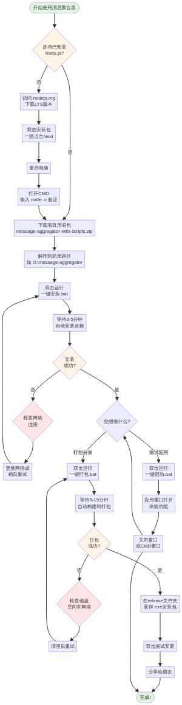

# 消息聚合器：零基础完整使用手册

**作者**: Manus AI  
**版本**: 1.0  
**目标读者**: 完全没有编程基础的用户

---

## 👋 前言

您好！非常感谢您使用“消息聚合器”。

这份手册是为您量身定制的，它将**像一本家电说明书一样**，用最简单、最直白的方式，一步一步地教您如何从零开始，在您的Windows电脑上成功运行这个应用程序，并最终打包成一个可以分享给朋友的`.exe`安装文件。

**请您放心，整个过程您不需要编写任何代码，也不需要理解任何复杂的技术术语。** 您只需要跟着这本图文并茂的手册，像搭积木一样，完成几个简单的步骤即可。

**这份手册将带您完成以下任务：**

1.  **准备环境**：安装一个必要的“地基”软件 (Node.js)。
2.  **获取项目**：下载并解压应用程序的全部文件。
3.  **安装程序**：双击一个脚本，自动完成所有复杂的安装工作。
4.  **启动程序**：双击另一个脚本，看到应用程序运行起来。
5.  **打包程序**：双击第三个脚本，生成一个可以分享的`.exe`安装包。

现在，请放松心情，让我们开始吧！🚀

---

## 第一部分：准备您的电脑环境 (只需做一次)

**目标**：安装一个名为 Node.js 的软件。这是我们这个程序运行所必需的“地基”。

**把它想象成**：就像您要玩一个游戏，需要先安装游戏平台（比如Steam或Wegame）一样。Node.js就是我们这个程序的“平台”。

### 步骤1：下载 Node.js 安装包

1.  **打开您的浏览器** (比如Chrome, Edge, Firefox等)。
2.  在地址栏输入并访问这个网址： **https://nodejs.org**
3.  打开网站后，您会看到两个绿色的下载按钮。请**点击左边的那个**，它通常会写着 **“LTS”** (长期支持版)，这是最稳定的版本。

    *(这会自动下载适合您电脑的安装包，通常是一个`.msi`文件)*

### 步骤2：安装 Node.js

1.  下载完成后，在您的“下载”文件夹里找到这个文件，它的名字通常是 `node-vXX.XX.X-x64.msi`。
2.  **双击这个文件**，开始安装。
3.  接下来，您会看到一个安装向导。您**不需要做任何修改，一路点击“Next”(下一步)即可**。

    -   **Welcome 界面**: 点击 `Next`
    -   **License Agreement (许可协议)**: 勾选 `I accept the terms...` (我接受)，然后点击 `Next`
    -   **Destination Folder (目标文件夹)**: 不需要修改，直接点击 `Next`
    -   **Custom Setup (自定义安装)**: 不需要修改，直接点击 `Next`
    -   **Tools for Native Modules (原生模块工具)**: **不要勾选**，直接点击 `Next`
    -   **Ready to Install (准备安装)**: 点击 `Install` (安装)

4.  安装过程可能需要1-2分钟。安装完成后，点击 `Finish` (完成)。

### 步骤3：验证安装是否成功

这是最重要的一步，用来确认我们的“地基”已经打好了。

1.  **按住键盘上的 `Win` 键 (就是那个有四个方块的窗户图标键)，再按一下 `R` 键**。这会打开一个叫“运行”的小窗口。
2.  在“运行”窗口的输入框里，输入 `cmd`，然后按“确定”或敲回车键。

    *(这会打开一个黑色的窗口，我们称之为“命令提示符”)*

3.  在这个黑色窗口里，**输入下面的命令**，然后敲回车：

    ```
    node -v
    ```

4.  如果您看到一行以 `v` 开头的版本号 (例如 `v20.11.0`)，**恭喜您！Node.js已经成功安装！**

5.  接着，再输入下一个命令，然后敲回车：

    ```
    npm -v
    ```

6.  如果您也看到了一个版本号 (例如 `10.2.4`)，那就完美了！

**至此，您的电脑环境已经准备就绪！** 这个部分的操作，以后再也不需要重复了。现在您可以关闭这个黑色窗口，进行下一部分的操作。

**如果遇到问题：**

-   **问题**：输入 `node -v` 后提示“不是内部或外部命令...”。
-   **原因**：这通常意味着安装没有成功，或者您没有重启电脑。
-   **解决**：
    1.  **重启您的电脑**。
    2.  如果重启后还是不行，请回到 **步骤2**，重新安装一遍Node.js。

---

## 第二部分：获取并安装“消息聚合器”

**目标**：下载项目的所有文件，并使用我们为您准备的一键脚本，自动完成所有复杂的安装步骤。

### 步骤1：下载项目文件

1.  您会收到一个名为 `message-aggregator-with-scripts.zip` 的压缩包文件。
2.  将这个文件保存到您的电脑上，比如“下载”文件夹。

### 步骤2：解压项目文件

1.  找到 `message-aggregator-with-scripts.zip` 这个文件。
2.  **右键点击它**，在弹出的菜单中选择 **“全部解压缩...”** 或 **“Extract All...”**。
3.  在弹出的窗口中，您可以选择一个解压位置。我们**强烈建议**您选择一个简单的路径，比如直接解压到 `D:` 盘根目录。您可以点击“浏览”，然后选择 `D:` 盘，最后文件夹路径看起来像 `D:\message-aggregator-with-scripts`。

    *(避免使用包含中文或空格的路径，这可以减少很多不必要的麻烦)*

4.  点击“解压”。完成后，会自动打开一个文件夹。

### 步骤3：运行“一键安装”脚本

这是最关键的一步，这个脚本会帮您自动完成所有繁琐的配置和安装工作。

1.  在刚刚解压的文件夹 `message-aggregator` 中，找到一个名为 **`一键安装.bat`** 的文件。

    *(它的图标可能是一个带有齿轮的窗口)*

2.  **双击运行这个 `一键安装.bat` 文件**。

    *(如果Windows弹出安全提示“Windows protected your PC”，请点击“More info”(更多信息)，然后点击“Run anyway”(仍要运行))* 

3.  双击后，会弹出一个黑色命令行窗口，并开始自动执行一系列操作。您会看到类似下面的文字：

    ```
    ========================================
       消息聚合器 - 一键安装脚本
    ========================================

    正在检查环境...
    [✓] Node.js 已安装
    ...
    开始安装项目依赖...
    这可能需要3-5分钟，请耐心等待...
    ```

4.  **现在，您唯一需要做的就是——等待。**

    这个过程会从网上下载几百个小文件，根据您的网络情况，可能需要 **3到10分钟**。请务必保持网络通畅，不要关闭这个窗口。

5.  当所有都安装完成后，您会看到成功提示：

    ```
    ========================================
       ✓ 安装完成！
    ========================================

    接下来您可以：
    1. 双击"一键启动.bat"运行应用
    2. 双击"一键打包.bat"生成.exe安装文件

    请按任意键继续...
    ```

6.  看到这个界面，就代表您的“消息聚合器”已经成功安装到电脑里了！现在您可以按键盘上任意一个键，关闭这个窗口。

**如果遇到问题：**

-   **问题**：窗口一闪而过就消失了。
-   **解决**：
    1.  **右键点击 `一键安装.bat`**。
    2.  在菜单中选择 **“以管理员身份运行”**。

-   **问题**：安装过程中出现很多红色的“error”字样，最后提示“安装失败”。
-   **原因**：这通常是网络问题，导致无法从国外服务器下载文件。
-   **解决**：
    1.  **更换网络环境**。比如，如果您用的是Wi-Fi，可以尝试用手机开热点给电脑连接，然后重新运行 `一键安装.bat`。
    2.  **关闭电脑的代理或VPN**，然后重试。
    3.  **多试几次**。有时候网络只是暂时不稳定，过一会儿再运行脚本可能就好了。

---

## 第三部分：启动并使用“消息聚合器”

**目标**：运行我们刚刚安装好的程序，看看它的庐山真面目。

在完成了第二部分的安装后，启动程序就变得非常简单了。

### 步骤1：运行“一键启动”脚本

1.  在项目文件夹中，找到一个名为 **`一键启动.bat`** 的文件。
2.  **双击运行它**。
3.  同样，会弹出一个黑色命令行窗口，显示如下信息：

    ```
    ========================================
       消息聚合器 - 一键启动脚本
    ========================================

    [提示] 正在启动应用...
    启动后会自动打开应用窗口
    如需停止，请关闭此窗口或按 Ctrl+C
    ```

4.  等待大约 **10-20秒**，您会看到一个新的、漂亮的应用程序窗口自动弹出——这就是“消息聚合器”的主界面！

### 步骤2：体验应用

现在，您可以像使用普通软件一样，在应用窗口里进行操作了：

-   点击左侧的菜单（时间线、账户管理、设置等）。
-   尝试在“账户管理”中添加您的平台账户。
-   体验各项功能。

### 步骤3：关闭应用

当您想关闭程序时，有两种方法：

1.  **直接关闭应用窗口**：像关闭其他软件一样，点击窗口右上角的“X”按钮。
2.  **关闭黑色命令行窗口**：这个黑色窗口是支撑着应用程序运行的“后台”，关闭它，应用程序也会随之关闭。

**重要提示**：这个“一键启动”的方式，我们称之为“开发模式”。它非常适合在开发和测试时使用，但如果您想把这个程序发给朋友，他们没有这个项目文件夹是无法运行的。因此，我们需要进行下一步——打包。

---

## 第四部分：打包成可分享的 .exe 安装包

**目标**：创建一个独立的 `.exe` 安装文件。任何人拿到这个文件，只需双击安装，就可以在他们的电脑上使用“消息聚合器”，而不需要Node.js，也不需要我们这个项目文件夹。

**把它想象成**：就像您从网上下载一个QQ或微信的安装包一样。

### 步骤1：运行“一键打包”脚本

1.  确保您已经成功完成了第二部分的“一键安装”。
2.  在项目文件夹中，找到一个名为 **`一键打包.bat`** 的文件。
3.  **双击运行它**。
4.  会弹出一个黑色命令行窗口，开始执行打包任务：

    ```
    ========================================
       消息聚合器 - 一键打包脚本
    ========================================

    [提示] 开始打包应用...
    这可能需要5-10分钟，请耐心等待...
    首次打包需要下载Electron（约100MB）
    ```

5.  **请再次耐心等待。** 打包是一个复杂的过程，它会把所有程序文件压缩并制作成一个安装包。这个过程通常需要 **5到15分钟**。

    *(特别是第一次打包，需要额外下载一个约100MB的打包工具，所以会更慢一些)*

6.  当打包成功后，窗口会显示：

    ```
    ========================================
       ✓ 打包成功！
    ========================================

    生成的文件位于 release 目录：
    message-aggregator-setup-1.0.0.exe

    按任意键打开 release 文件夹...
    ```

7.  此时，**一个名为 `release` 的新文件夹会自动打开**，您会看到里面静静地躺着一个文件：`message-aggregator-setup-1.0.0.exe`。

**恭喜您！您已经成功制作出了一个属于您自己的应用程序安装包！**

### 步骤2：测试您的安装包

1.  双击这个 `message-aggregator-setup-1.0.0.exe` 文件。
2.  您会看到一个标准的Windows安装向导。
3.  您可以选择安装位置，然后点击“安装”。
4.  安装完成后，您的桌面上会出现一个新的“消息聚合器”快捷方式。
5.  双击桌面快捷方式，应用程序就会启动！

现在，您可以把这个 `.exe` 文件通过微信、QQ、邮件或者U盘，分享给您的任何朋友了！

**如果遇到问题：**

-   **问题**：打包过程非常非常慢，或者卡在“downloading”不动。
-   **原因**：还是网络问题。
-   **解决**：
    1.  关闭窗口，**更换网络** (比如用手机热点) 后，重新运行 `一键打包.bat`。
    2.  我们的脚本已经内置了国内镜像，但如果还是不行，请确保您的电脑**没有开启任何代理或VPN**。

---

## 总结与祝贺

🎉 **恭喜您！** 🎉

您已经靠自己的双手，完成了一个软件从配置、安装、运行到最终打包的全过程！

现在，我们来回顾一下这几个一键脚本的作用：

-   `一键安装.bat`：**“打地基”**，只需在开始时运行一次。
-   `一键启动.bat`：**“开灯测试”**，用来在开发时快速查看程序效果。
-   `一键打包.bat`：**“装进礼品盒”**，用来生成可以送给别人的安装包。

希望这份超详细的手册能帮助到您。如果您在严格按照本手册操作后仍然遇到问题，请随时带着错误信息的截图来找我。祝您使用愉快！


---

## 附录：可视化流程图

### 快速参考流程

以下是整个使用流程的简化版本，方便您快速查阅：


### 完整详细流程

以下是包含所有步骤和决策点的完整流程图：



---

## 附录：常见问题汇总

### Q1: 为什么需要安装Node.js？

**答**: Node.js是一个JavaScript运行环境。我们的"消息聚合器"是用JavaScript语言编写的，就像您需要安装Office才能打开Word文档一样，您需要Node.js才能运行和打包这个程序。

### Q2: 安装依赖时下载的是什么？

**答**: 我们的程序依赖很多第三方的"零件"（我们称之为"依赖包"或"库"）。比如，用来显示漂亮界面的Ant Design，用来操作数据库的better-sqlite3等等。`一键安装.bat`会自动从网上下载这些"零件"并组装好。

### Q3: 为什么打包后的.exe文件这么大（150-200MB）？

**答**: 因为这个.exe文件不仅包含了我们的程序代码，还内置了一个完整的浏览器引擎（Chromium）和Node.js运行时。这样做的好处是，用户的电脑上不需要安装任何其他东西，双击就能用。这是所有基于Electron框架的应用的共同特点（比如VS Code、Slack等）。

### Q4: 我可以修改程序的功能吗？

**答**: 当然可以！所有的源代码都在`src/`文件夹里。如果您懂一些编程，可以自由修改。修改后，重新运行`一键启动.bat`就能看到效果，重新运行`一键打包.bat`就能生成新的安装包。

### Q5: 如何卸载这个程序？

**答**: 
-   **开发版本**（项目文件夹）：直接删除整个文件夹即可。
-   **安装版本**（通过.exe安装的）：在Windows的"设置" > "应用" > "应用和功能"中找到"消息聚合器"，点击卸载。

### Q6: 打包时提示"Windows protected your PC"怎么办？

**答**: 这是Windows的安全提示，因为我们的程序没有数字签名。点击"More info"（更多信息），然后点击"Run anyway"（仍要运行）即可。如果您想去除这个警告，需要购买代码签名证书（约$200-500/年），这对个人开发者来说不太划算。

### Q7: 我想修改应用的图标，怎么做？

**答**: 
1.  准备一张256x256像素的PNG图片。
2.  替换项目文件夹中的`public/icon.png`文件。
3.  重新运行`一键打包.bat`。

### Q8: 我想修改应用的名称和版本号，怎么做？

**答**: 
1.  用记事本打开项目文件夹中的`package.json`文件。
2.  找到`"productName": "消息聚合器"`这一行，修改引号中的内容。
3.  找到`"version": "1.0.0"`这一行，修改版本号。
4.  保存文件，重新运行`一键打包.bat`。

---

## 结语

再次感谢您的耐心阅读！我们深知，对于没有编程基础的朋友来说，这些步骤可能看起来有些复杂。但请相信，只要您按照本手册一步一步来，一定能够成功！

如果您在使用过程中遇到任何问题，或者有任何建议，欢迎随时反馈。我们会持续改进这份手册，让它变得更加易懂和实用。

祝您使用愉快！🎉

---

**文档作者**: Manus AI  
**最后更新**: 2025年10月31日  
**版本**: 1.0
